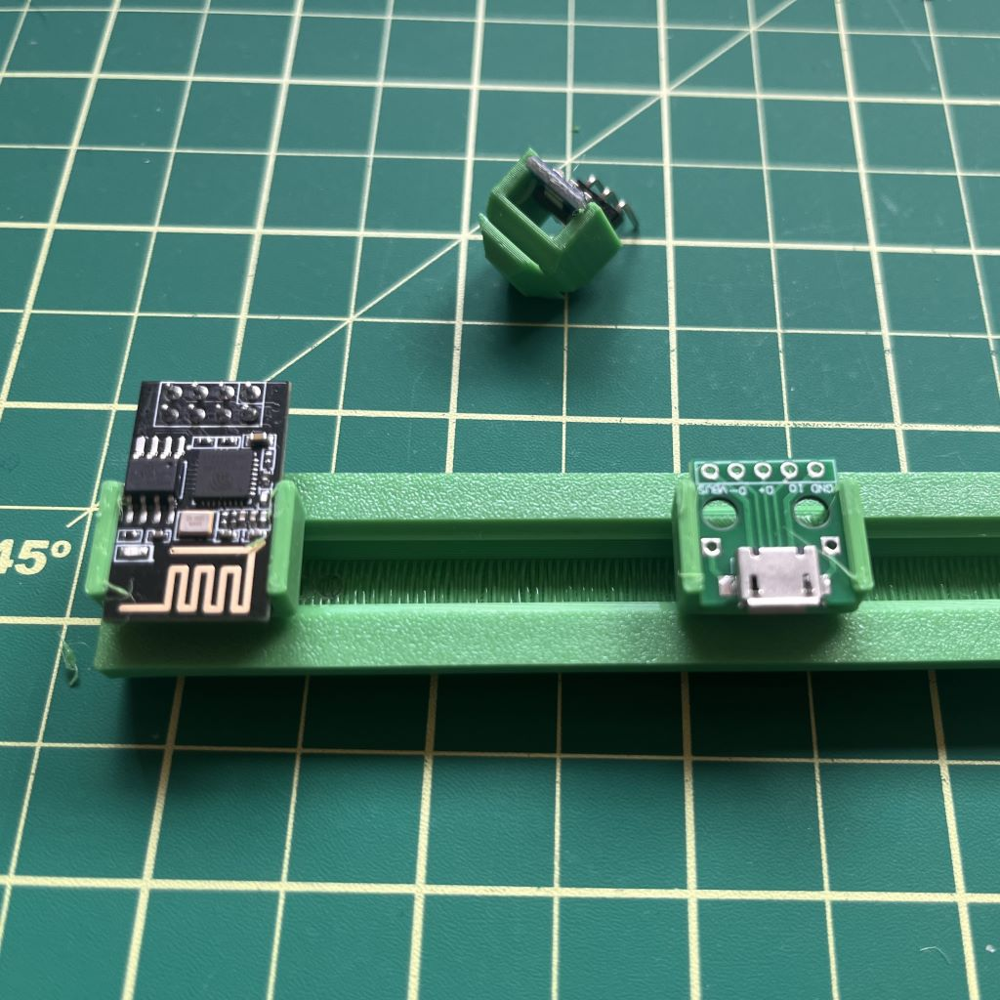

# Project Slot

A 3d printable mounting system for small modular projects.

Inspired by DIN-rails, and compatible with 2020 aluminum extrusion.

# Components

- `projectslot`: stls/projectslot-v2-100mm.stl
    - These are the mounting rails. They are modelled on the v-slot in 2020 aluminum extrusion, and lots of hardware that works with 2020 should work with them. They have M3 holes at both ends to make them easy to mount. The rails are 100mm long, but could be extended to any length your 3d printer can handle.
    - 
- `pcb-mounts`: stls/ps-pcb-mount-v3.stl
    - This is a little PCB side clip that clamps on using a t-nut and an M3x6 bolt. Use two to mount a PCB. This component is more flexible since you don't need to know the PCB size ahead of time, but it can be hard to clamp the PCB on tightly, and requires the most hardware. 3d printable t-nuts can be found on thingiverse [here](https://www.thingiverse.com/thing:3050607) & [here](https://www.thingiverse.com/thing:1609323).
    - 
- `pcb-slide-in-clip`: stls/ps-*mm-pcb-slide-in-clip.stl
    - This is a friction fit component for holding a small PCB in place. It uses no hardware, but you'll have to generate a model that's exactly the width of your PCB to use this. It's also a bit sensitive to the calibration of your printer - so you may have to play with the "PCB width" variable a bit to get a tight (but not too tight) fit.
    - 

# CAD

The project is build in FreeCAD, which I am VERY new to so if you have suggestions for ways to improve the CAD, please make a PR or open an issue. Editable parameters are found in a FreeCAD spreadsheet, for quick editing.

Note: if you make `Spreadsheet.pcb_width` too small when adjusting `pcb-slide-in-clip`, you'll have to reduce `Spreadsheet.chamfer` as well. When shrinking the PCB width, if you notice one of the sides getting cut off, try changing in 1mm increments - freecad seems to get confused if you change it too dramatically.

# Printing tips

- All the accessories print without supports. 0.2mm layer height works well. Print in the same orientation as they sit on the rail - all the angles are 45 degrees so you shouldn't need supports to print them.
- The rails print best with the open side down. I used tree supports for around the two mounting holes.

# Todos

- More mounting styles
- Auto generate stls in a bunch of common sizes using github actions
- Find a way to print rails without supports

# Useful compatible models

I haven't tested these all, but they should work;

- t-nuts [thing:3050607](https://www.thingiverse.com/thing:3050607) & [thing:1609323](https://www.thingiverse.com/thing:1609323).
- [snap in PCB mount (use with t-nuts)](https://www.printables.com/model/304699-configurable-snap-in-pcb-mount).
- [Twist-in cable clamp](https://www.thingiverse.com/thing:2613532).
- [2020 flat cable clip](https://www.thingiverse.com/thing:2367717).
- [cable clip for 2020 profile voron](https://www.thingiverse.com/thing:5204184).